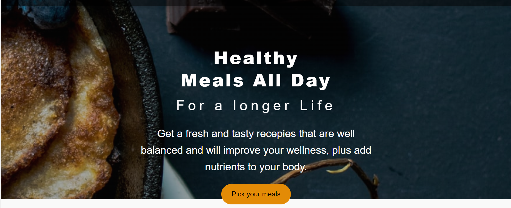
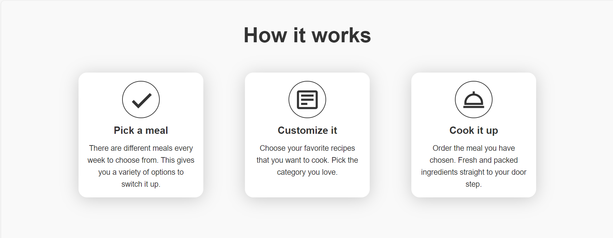
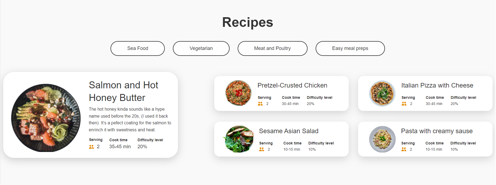
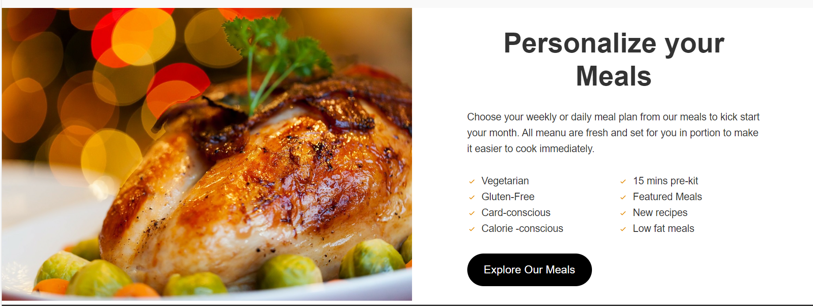
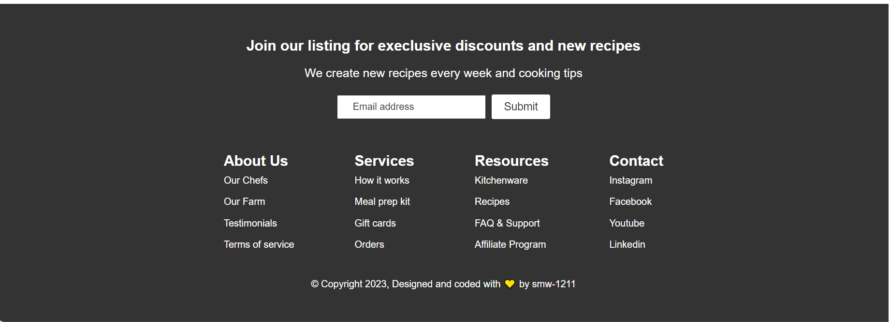

# Getting Started with Create React App

This project was bootstrapped with [Create React App](https://github.com/facebook/create-react-app).

## Available Scripts

In the project directory, you can run:

### `npm start`

Runs the app in the development mode.\
Open [http://localhost:3000](http://localhost:3000) to view it in your browser.

The page will reload when you make changes.\
You may also see any lint errors in the console.

### `npm run build`

Builds the app for production to the `build` folder.\
It correctly bundles React in production mode and optimizes the build for the best performance.

The build is minified and the filenames include the hashes.\
Your app is ready to be deployed!

See the section about [deployment](https://facebook.github.io/create-react-app/docs/deployment) for more information.

## Project Description

> Welcome to Foodifyy, your go-to destination for culinary inspiration, mouthwatering recipes, and delightful food adventures! Whether you're a seasoned chef, a kitchen novice, or simply a food enthusiast looking for new flavors to explore, you've come to the right place. Explore the various sections of the website.

### Navbar Section

### Hero Section

### How It Works Section

### Recipes Section

### Personalized-Meal Section

### Footer Section

## Give it a Star

  

If you find this repo useful , give it a star :star: so as many people can get to know it.

  

## Credits

An initiative With :heart: from [Soham Wattamwar ](https://www.linkedin.com/in/soham-wattamwar-9b790119a)